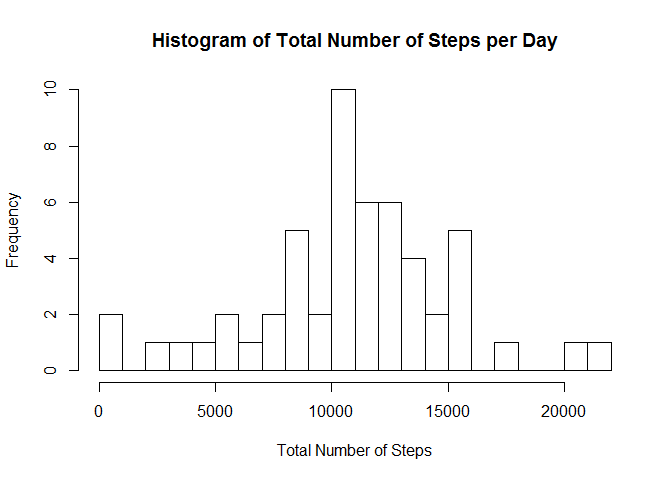
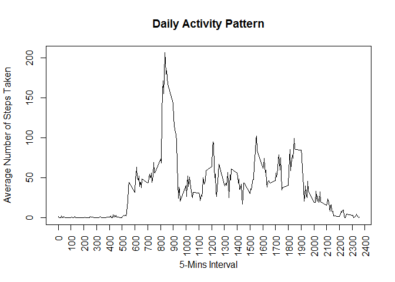
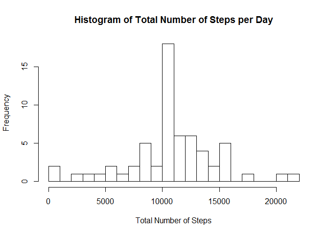
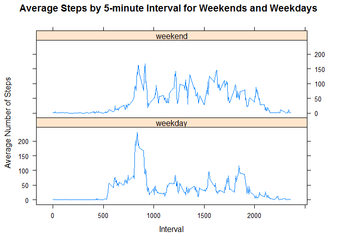

# Reproducible Research: Peer Assessment 1


## Loading and preprocessing the data


```r
setwd("C:/Coursera/ReproducibleResearch/Assessment1/RepData_PeerAssessment1")    # set the working directory


library("dplyr")     # for structuring data 
library("ggplot2")   # for plots
library("lattice")  # for weekday weekend plot
library(Hmisc)      # for impute


rm(list=ls()) # Clear the workspace

activity <- read.csv(unzip("activity.zip","activity.csv"))  # Read in data from zip file
```


## What is mean total number of steps taken per day?


#### 1. Make a histogram of the total number of steps taken each day

```r
Total_Steps_By_Date <- activity %>% group_by(date) %>% summarise(Total_Steps = sum(steps))    # calculate the total number of steps by date

hist(Total_Steps_By_Date$Total_Steps, breaks = 25, main = "Histogram of Total Number of Steps per Day" , xlab = "Total Number of Steps")   # function hist ignore missing value 
```

 


#### 2. Calculate and report the mean total number of steps taken per day

```r
mean((Total_Steps_By_Date$Total_Steps), na.rm = TRUE)
```

```
## [1] 10766.19
```
##### The mean number of steps per day is 10766


#### Calculate and report the median total number of steps taken per day

```r
median((Total_Steps_By_Date$Total_Steps), na.rm = TRUE)
```

```
## [1] 10765
```
##### The median number of steps per day is 10765


## What is the average daily activity pattern?


#### 1. Make a time series plot (i.e. type = "l") of the 5-minute interval (x-axis) and the average number of steps taken, averaged across all days (y-axis)


```r
activity$interval.factor <- as.factor(activity$interval)  # convert to number for ploting
Avg_Num_Steps_by_interval <- activity %>% group_by(interval.factor) %>% summarise(mean.steps = mean(steps, na.rm =TRUE))   #Calculate average number of steps per interval

Avg_Num_Steps_by_interval$interval.numeric <- as.numeric(as.character(Avg_Num_Steps_by_interval$interval.factor)) # convert to numeric or ploting

plot(Avg_Num_Steps_by_interval$interval.numeric, Avg_Num_Steps_by_interval$mean.steps, type = "l", xaxt="n",
     xlab = "5-Mins Interval", ylab = "Average Number of Steps Taken", main = "Daily Activity Pattern")
    axis(1, at = seq(0, 2400, by = 100), las = 2)   # plot
```

 


#### 2. Which 5-minute interval, on average across all the days in the dataset, contains the maximum number of steps?


```r
max_steps_interval <- which.max(Avg_Num_Steps_by_interval$mean.steps)
Avg_Num_Steps_by_interval[max_steps_interval, 3]
```

```
## Source: local data frame [1 x 1]
## 
##   interval.numeric
## 1              835
```

##### The 5 minute interval with the maximum number of steps is 8:35 am


## Imputing missing values


#### 1. Calculate and report the total number of missing values in the dataset (i.e. the total number of rows with NAs)


```r
sum(is.na(activity$steps))
```

```
## [1] 2304
```
#####  Total number of missing values is 2304.


#### 2. Devise a strategy for filling in all of the missing values in the dataset. The strategy does not need to be sophisticated. For example, you could use the mean/median for that day, or the mean for that 5-minute interval, etc.


##### The Strategy is impute the missing value by the mean of corresponding 5 mins interval.


#### 3. Create a new dataset that is equal to the original dataset but with the missing data filled in.


```r
library(plyr)       # for impute
activity_imputed <- ddply(activity, "interval", mutate, steps = impute(steps, mean)) # impute missing value by mean of 5 min interval

attach(activity_imputed)  
activity_imputed <- activity_imputed[order(date, interval),]   # put it in original order
detach(activity_imputed)
head(activity_imputed)
```

```
##         steps       date interval interval.factor
## 1   1.7169811 2012-10-01        0               0
## 62  0.3396226 2012-10-01        5               5
## 123 0.1320755 2012-10-01       10              10
## 184 0.1509434 2012-10-01       15              15
## 245 0.0754717 2012-10-01       20              20
## 306 2.0943396 2012-10-01       25              25
```


#### 4. Make a histogram of the total number of steps taken each day and Calculate and report the mean and median total number of steps taken per day. Do these values differ from the estimates from the first part of the assignment? What is the impact of imputing missing data on the estimates of the total daily number of steps?


```r
detach("package:dplyr", unload=TRUE)   # plyr appears to conflict with dplyr, need to unload first
library("dplyr")  
Total_Steps_By_Date <- activity_imputed %>% group_by(date) %>% summarise(Total_Steps = sum(steps))    # calculate the total number of steps by date

hist(Total_Steps_By_Date$Total_Steps, breaks = 25, main = "Histogram of Total Number of Steps per Day" , xlab = "Total Number of Steps")   # histogram after imputed missing value 
```

 


#### Calculate and report the mean total number of steps taken per day

```r
mean((Total_Steps_By_Date$Total_Steps))
```

```
## [1] 10766.19
```
##### The mean number of steps per day is 10766


#### Calculate and report the median total number of steps taken per day

```r
median((Total_Steps_By_Date$Total_Steps))
```

```
## [1] 10766.19
```
##### The median number of steps per day is 10766


##### After imputing misssing value, mean is same as before, median has slightly increased. In general, The impact of imputing missing data using mean or median is very tiny.


## Are there differences in activity patterns between weekdays and weekends?


#### 1. Create a new factor variable in the dataset with two levels -- "weekday" and "weekend" indicating whether a given date is a weekday or weekend day.


```r
activity_imputed$weekday <- weekdays(as.Date(activity_imputed$date))

activity_imputed$dateType <-  ifelse(activity_imputed$weekday %in% c("Saturday","Sunday"), 'weekend', 'weekday')
```
##### The new factor variable is activity_imputed$dateType 

#### 2. Make a panel plot containing a time series plot (i.e. type = "l") of the 5-minute interval (x-axis) and the average number of steps taken, averaged across all weekday days or weekend days (y-axis).


```r
activity_imputed_mean <- activity_imputed %>% group_by(dateType, interval) %>% summarise(mean.steps = mean(steps))  # calculate mean number of steps by dataType and interval


xyplot(mean.steps ~ interval | dateType, data = activity_imputed_mean, 
       type = "l", layout = c(1,2), xlab = "Interval", ylab = "Average Number of Steps", 
       main = "Average Steps by 5-minute Interval for Weekends and Weekdays")
```

 

##### Activity pattern between weekdays and weekends are clearly different. Distribution of steps are peaked between 8am and 9am during weekday, while steps are at a higher level and more evenly distribution during daytime of weekend.
